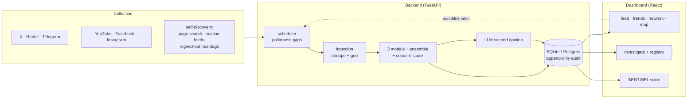

<div align="center">

# 🛡️ SENTINEL

### Public-sentiment intelligence for the Gujarat Police

Monitors what four cities are actually saying — across X, Reddit, Telegram,
YouTube, Facebook and Instagram — with first-class NLP for **Gujarati, Hindi,
Hinglish, Gujlish and English**, the exact segment generic moderation misses.

Deployment scope: **Surat · Ahmedabad · Vadodara · Rajkot** (`TARGET_CITIES`).

`git clone` → **one command** → both models trained → a live multilingual
dashboard. **No API keys required to start.**

</div>

---

## ⚡ Quick start

```bash
git clone <your-repo-url>
cd E-Rakshak-Sentiment-Analysis
```
```powershell
.\run.ps1            # Windows
```
```bash
./run.sh             # Linux / macOS
```

That is the whole thing. One terminal starts **both** services, with their
output interleaved and labelled `[api]` / `[web]`; **Ctrl+C stops both**. It
creates the virtualenv, installs what is missing, waits for the API to answer
and opens the dashboard.

```
  SENTINEL  -  Gujarat Police social-media intelligence

==> starting the API on http://localhost:8000
==> starting the dashboard on http://localhost:5173
[web]   VITE v5.4.21  ready in 479 ms
[api] INFO:     Application startup complete.

  SENTINEL is live
    dashboard   http://localhost:5173
    API docs    http://localhost:8000/docs
```

| Sign in | |
|---|---|
| Username | `suratpolice` |
| Password | `Suratpolice@1234` |

That account is provisioned on first boot with the **admin** role. It is a
*known* credential — it lives in `backend/app/config.py`, which lives in this
repository — so the server warns at every boot and Admin Panel → Security
Posture flags it until you change it. Set `BOOTSTRAP_ADMIN_PASSWORD` in
`backend/.env` before this instance holds real case data.

**For the trained models** (optional — the app runs on generic ones until then):

```bash
cd backend && python -m app.ml.bootstrap
```

One command: downloads 21 raw public datasets, trains both models, writes the
evaluation reports. Takes a while and wants a GPU ([docs/GPU.md](docs/GPU.md)).

Flags, ports, every CLI tool and the full `.env` reference:
**[docs/OPERATIONS.md](docs/OPERATIONS.md)**.

---

## What it does

**Collects** public posts from seven platform adapters on politeness-gapped
schedules, and **finds the accounts worth collecting from by itself** — 1,214
Facebook pages across the four cities, discovered by searching in English,
Gujarati, Devanagari *and* romanized script, because a page called
"સુરત સમાચાર" contains the string "Surat" nowhere at all.

**Labels** every post positive / negative / neutral using **three independent
models plus an LLM review**, so a label is never one model's opinion — and every
vote is stored, so an analyst can see exactly how it was reached.

**Scores** each post 0-100 for concern, shaped so that no single dimension
reaches an alert band alone: a furious post nobody read tops out near 50, and a
viral cheerful post cannot pass 30.

**Investigates** — image and video forensics (EXIF, GPS, perceptual hashes,
manipulation signals), face detection and 1:N matching against a suspect
registry, cross-platform username lookup, coordinated-campaign detection.

**Answers out loud.** An officer can ask the console questions by voice; the
assistant runs the same guard, the same rank-filtered tools and the same audit
write as the typed endpoint.

---

## The system in one picture



Full detail: **[docs/ARCHITECTURE.md](docs/ARCHITECTURE.md)**

---

## Measured accuracy

Both trained models, evaluated on the same 5,973-row held-out split of **real**
data (`backend/app/ml/*_report.json`):

| Language | rows | Transformer (MuRIL) | Classical (TF-IDF+SVC) |
|---|---:|---|---|
| Gujarati | 229 | **0.838** | 0.764 |
| Gujlish | 800 | **0.828** | 0.759 |
| Hindi | 1,144 | **0.740** | 0.668 |
| English | 2,000 | **0.687** | 0.611 |
| Hinglish | 1,800 | **0.632** | 0.611 |
| **Overall accuracy** | **5,973** | **0.705** | 0.647 |

Hinglish is the hardest class for both, and it is also the highest-volume form
in a real city feed — which is exactly why there is an ensemble and an LLM
review rather than one classifier. See **[docs/MODELS.md](docs/MODELS.md)**.

---

## The three models

| # | Model | Sees | Good at | Weight |
|---|---|---|---|---|
| 1 | `google/muril-base-cased`, fine-tuned | context-tagged text | word order, negation scope, contrast | 0.706 |
| 2 | TF-IDF (word 1-2 + **char 2-5**) → LinearSVC | same input, vectorised | spelling chaos, transliteration variance | 0.640 |
| 3 | Multilingual valence lexicon + rules | same input | explaining itself in one sentence | 0.560 |

They are chosen to **fail differently** — three transformers would agree with
each other and with their shared pre-training bias.

Two or three agreeing wins. All three disagreeing hands it to the most confident
model, weighted by measured reliability. Metadata (account age, reach,
amplification) then adjusts **confidence only, never the label** — a burner
account is not more negative, it is more suspicious. Finally an LLM reviews the
verdict and may overturn it at confidence ≥ 0.75, always recorded as an override.

---

## The concern score

```
concern = 100 × clamp01(
      0.50 × negativity × confidence
    + 0.22 × toxicity
    + 0.18 × virality
    + 0.10 × term_severity )
```

| Band | Threshold | Share of corpus |
|---|---:|---:|
| critical | ≥ 60 | 0.04% |
| high (alert) | ≥ 50 | 0.41% |
| elevated | ≥ 35 | 2.4% |

**This is not a threat classification.** The four threat labels this project
once had were deliberately removed: a sentiment model reading one post cannot
know whether a sentence will incite violence or whether a claim in it is false.
What remains is defensible — *this post is negative, we are this sure, its
language is this abusive, and it travelled this far.* The officer draws the
conclusion. See **[docs/SCORING.md](docs/SCORING.md)**.

---

## Documentation

| Document | Covers |
|---|---|
| [docs/ARCHITECTURE.md](docs/ARCHITECTURE.md) | the whole system, the one path a post takes, failure posture |
| [docs/OPERATIONS.md](docs/OPERATIONS.md) | running it, every CLI tool, the full `.env` reference |
| [docs/COLLECTION.md](docs/COLLECTION.md) | seven platforms, politeness, account discovery, the five languages |
| [docs/NLP-PIPELINE.md](docs/NLP-PIPELINE.md) | language ID, context extraction, translate-never-filter |
| [docs/MODELS.md](docs/MODELS.md) | the three models in depth, training, per-language evaluation |
| [docs/SCORING.md](docs/SCORING.md) | the concern formula, band calibration, what it refuses to claim |
| [docs/LLM.md](docs/LLM.md) | Groq + Gemini, fallback chains, verification, news corroboration |
| [docs/VOICE.md](docs/VOICE.md) | realtime engine, the cascade, packets, interruption, wake word |
| [docs/FORENSICS.md](docs/FORENSICS.md) | media forensics, face identification, OSINT, the media proxy |
| [docs/SECURITY.md](docs/SECURITY.md) | auth, roles, rate limits, biometric encryption, audit, admin |
| [docs/GPU.md](docs/GPU.md) | CUDA setup, what is accelerated, what is not |
| [docs/SUPABASE.md](docs/SUPABASE.md) | moving off SQLite |
| [docs/FRAMEWORKS.md](docs/FRAMEWORKS.md) | every dependency and why it is there |
| [docs/diagrams/](docs/diagrams/) | Mermaid sources for every diagram |

---

## Going live

Every platform works with no key at all in a reduced mode, and upgrades in place
when you add one. Keys go in `backend/.env` (gitignored); list settings take a
**JSON array**, not a comma-separated string.

```env
SIMULATION_ENABLED=false          # live data only

# platforms — all optional, each degrades gracefully
X_AUTH_TOKEN=  X_CT0=             # or X_BEARER_TOKEN for the official API
REDDIT_CLIENT_ID=  REDDIT_CLIENT_SECRET=
TELEGRAM_API_ID=  TELEGRAM_API_HASH=  TELEGRAM_SESSION_STRING=
YOUTUBE_API_KEY=
FB_PAGE_IDS_RAW=["suratcitypolice:Surat"]
IG_SESSIONID=

# LLMs — free tiers are enough
GROQ_API_KEY=                     # post pipeline
GEMINI_API_KEY=                   # the assistant

# security — set all three before real case data
SECRET_KEY=
BOOTSTRAP_ADMIN_PASSWORD=
BIOMETRIC_ENCRYPTION_KEY=
```

Then widen coverage past the official pages:

```bash
cd backend && python -m app.crawlers.facebook_discover
```

**API etiquette is a requirement, not a setting.** The scheduler enforces a
per-platform gap (5 min default, 30 for Instagram and the Facebook browser, 40
for YouTube) regardless of tick speed. Rapid queries to one endpoint get the
source blocked, which costs the deployment a platform. Leave the gaps alone.

---

## Security posture

This API serves criminal records. In short: HS256 pinned at decode with
token-version revocation; scrypt passwords; three strictly-ordered roles checked
as "at least this rank"; per-identity sliding-window rate limits; wildcard CORS
**refused at startup**; SSRF guards on every analyst-supplied URL; face
templates encrypted with Fernet because a leaked face vector is irrevocable; and
an append-only audit trail enforced by database triggers rather than
application code.

Full detail and the deployment checklist: **[docs/SECURITY.md](docs/SECURITY.md)**.

---

## Tests

```bash
cd backend && python -m pytest tests/ -q      # 365 tests
cd frontend && npm run test                   # 11 tests
cd frontend && npx tsc -b --noEmit            # typecheck
```

The backend suite never touches the network — Instagram's signed-out routes and
the discovered-account roster are stubbed by autouse fixtures.

---

<div align="center">
<sub>Built for the Gujarat Police · mentored by NIC Rajkot</sub>
</div>
