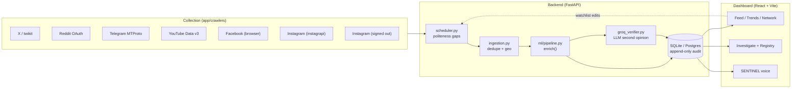
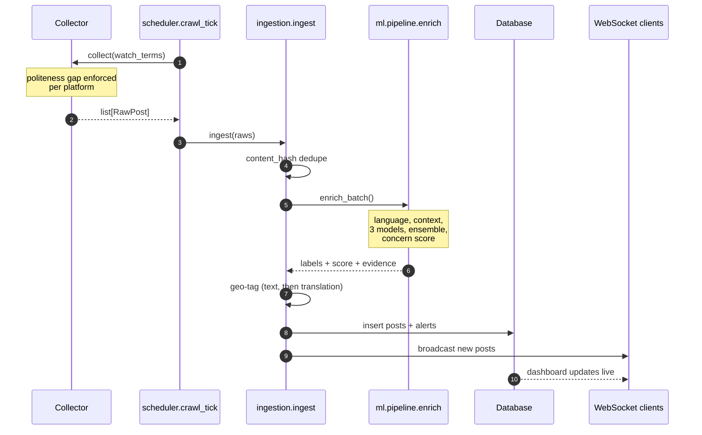

# Architecture

One FastAPI process, one React app, one database. Everything else is a module
inside the API process: the crawlers, the NLP pipeline, the LLM clients, the
voice pipeline and the forensics tools all run in-process, and the only
background machinery is an APScheduler job that ticks the crawl loop.

That is a deliberate shape for this deployment. A control room running a single
service can be started with one command, moved to one host, and reasoned about
by one person on call; there is no queue to drain, no worker fleet to keep in
sync, and no partial-outage state where posts are collected but never scored.

## The packages

| Package | What lives there |
|---|---|
| `app/crawlers/` | One adapter per platform, plus discovery and roster ([COLLECTION.md](COLLECTION.md)) |
| `app/ml/` | Language ID, context, the three models, the concern score ([MODELS.md](MODELS.md), [SCORING.md](SCORING.md)) |
| `app/services/` | Ingestion, scheduler, LLM clients, trends, network, reports, notifications |
| `app/services/assistant/` | The tool-calling agent, its guard and its read-only SQL sandbox |
| `app/services/voice/` | The realtime engine and the cascade pipeline ([VOICE.md](VOICE.md)) |
| `app/osint/` | Image/video forensics, face detection and matching, username lookup ([FORENSICS.md](FORENSICS.md)) |
| `app/security/` | Tokens, roles, rate limits, biometric encryption, SSRF guards ([SECURITY.md](SECURITY.md)) |
| `app/routers/` | HTTP surface; every route is thin and delegates to a service |
| `app/models/` | SQLModel tables |
| `frontend/src/` | React 18 + Vite dashboard |

## The one path a post takes

Everything a post ever becomes is decided in one function call chain, and every
producer uses it. There is no second path where a post is written without being
scored.

`RawPost` (in `app/schemas/`) is the contract between the two halves: a
collector's only job is to produce one, and nothing downstream knows or cares
which platform it came from. Adding a platform is one new file in
`app/crawlers/` and one line in `registry.py`.

## Request-time architecture

The API is authenticated with signed session tokens, rate-limited per identity,
and every route that reads case data or runs an investigation writes an audit
row. Two channels are long-lived rather than request/response:

* `/ws/live` — the dashboard's live feed. The ingest loop broadcasts new posts
  and alerts as they land, so the feed is push, not poll.
* `/ws/voice` — the voice channel, authenticated in the handshake with the same
  token and passed through the same assistant guard as the typed endpoint.

## Storage

SQLite by default so a fresh clone runs with no setup; point `DATABASE_URL` at
Postgres (Supabase included) and the same migrations and append-only audit
triggers are applied there instead — `database.py` detects the dialect. Nothing
in the application deletes history on its own; retention is an explicit admin
action. See [SUPABASE.md](SUPABASE.md).

## What runs on a schedule

| Job | Interval | Where |
|---|---|---|
| Crawl tick | `INGEST_INTERVAL_SECONDS` (4 s), each platform gated by its own `min_interval_seconds` | `services/scheduler.py` |
| Emerging-rumour cache prime | every tick, off the event loop | `services/emerging.py` |
| Groq verification | inside ingestion, budgeted per tick (`GROQ_MAX_PER_TICK`) | `services/groq_verifier.py` |

The tick is fast and the politeness gaps are what actually pace the live
platforms — 5 minutes by default, 30 minutes for Instagram and the Facebook
browser, 40 for YouTube. Those numbers are a requirement, not a tuning knob:
rapid-fire queries to one endpoint get the source blocked, which costs the
deployment a platform. See [COLLECTION.md](COLLECTION.md).

## Failure posture

* An adapter must never raise out of `collect()`; it logs and returns `[]`, so
  one dead platform cannot stall ingestion.
* Every adapter has a `timeout_seconds`; the scheduler abandons a hung one and
  moves on, because adapters run one after another in a tick.
* A platform that holds credentials it cannot use reports itself **offline with
  a reason** rather than green-and-silent. That distinction exists because a
  source once sat at zero posts behind a green light for weeks.
* LLM features degrade to "unavailable" rather than to a guess. There is no
  local-model tier — see [LLM.md](LLM.md) for why.
