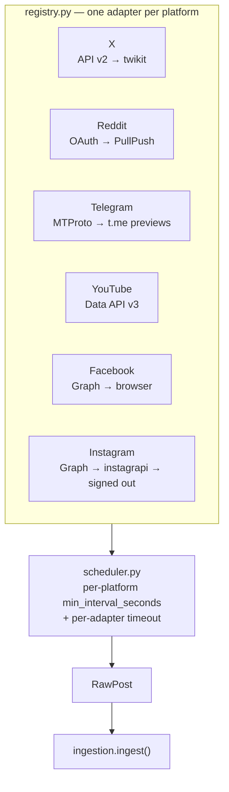
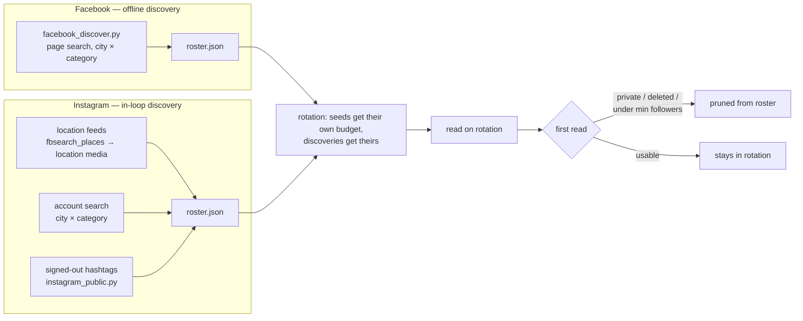

# Collection

Seven platforms, one contract. A collector's only job is to return
`list[RawPost]`; nothing downstream knows which platform a post came from.



Each platform lists its adapters in preference order and **exactly one runs** —
the first that is configured. Dropping an official API key into `.env` upgrades
the source in place with no duplicate ingestion; removing it falls straight back.

## Politeness is a requirement, not a setting

The mentor requirement from NIC Rajkot was explicit: rapid queries to one
endpoint get the source blocked. The scheduler enforces a per-collector gap
regardless of how fast the tick runs.

| Platform | Gap | Why |
|---|---|---|
| Default (`CRAWL_MIN_INTERVAL_SECONDS`) | 300 s | baseline politeness |
| YouTube | 2,400 s | quota, not politeness — see below |
| Instagram (instagrapi) | 1,800 s | private-API reads get an account blocked fastest |
| Facebook (browser) | 1,800 s | a real session browsing real pages |

**YouTube is quota-bound.** `search.list` costs 100 units against 10,000/day, so
the full watchlist would drain a day's budget in three collects. The adapter
searches a rotating slice per cycle and stops when its self-imposed budget is
spent — every term still gets covered, spread across the day.

## Seed sources, and why they are not enough

The original strategy was a hand-curated seed list per city: municipal
corporations, police, districts, news desks (`FB_PAGE_IDS`,
`IG_SEED_USERNAMES`, `REDDIT_SUBREDDITS`, `TELEGRAM_CHANNELS`, each with an
optional `:City` tag).

That roster answers "what does the city announce about itself". It does not
answer "what does the city think", because a city's opinion of its police is not
posted on the police page. And a hand-maintained list of every influencer, food
page, college page and neighbourhood desk across four cities is stale the week
after it is written.

So the crawlers **find accounts themselves**, and keep what they find in
`backend/discovered_accounts.json` (`app/crawlers/roster.py`, gitignored).



### Facebook discovery

```bash
cd backend
python -m app.crawlers.facebook_discover              # every target city
python -m app.crawlers.facebook_discover --dry-run    # print, write nothing
```

It drives the existing logged-in browser over Facebook's own page directory
across a city × category matrix — news, food, colleges, jobs, markets, events,
community, photography and more.

**It is a command, not a crawl leg.** Facebook's search is the most aggressively
rate-limited surface it has; running it inside the ingest loop is the fastest
way to lose the account. A discovery run is a few dozen searches once a month,
under a human's eye, and the crawl loop stays a browser reading pages.

**Every script the cities are written in.** Each city is searched in English,
Gujarati (`સુરત સમાચાર`), Devanagari (`सूरत समाचार`) and romanized (`Surat
samachar`, `khabar`, `batmi`), with the category terms in the alias's own
script. A page called "સુરત સમાચાર" contains the string "Surat" nowhere at all —
an English-only matrix reaches only the English-named half of a Gujarati city.
Measured: of 1,214 pages discovered, **367 came only from the local-language
pass** and 287 have Indic-script names, including Surat Municipal Corporation's
own page.

**Location filtering is not optional.** "Surat" is also a province of Thailand
and a district of Bangladesh, and both rank above the real city in Facebook's
results. A page must name a target city *and* look like it is in Gujarat.

### Instagram discovery

Three routes, in the collect loop:

* **Location feeds** — resolve each city to real places, then read their media.
  This is the only route that reaches ordinary residents: anyone who geo-tags a
  place in Surat is in it, with no hashtag and no prior knowledge of them. Every
  author it turns up is geo-proven and goes into the roster.
* **Account search** over a city × category matrix.
* **Signed-out hashtags** — see below.

Places are filtered by **coordinates** where they have them (Gujarat's bounding
box), because no amount of naming ambiguity moves a point on the globe.

### The roster corrects itself

Discovery is cheap and therefore imprecise — it reports whoever posted, private
and nine-follower accounts included. The correction happens on first read: an
account that is private, deleted, or under `IG_DISCOVERED_MIN_FOLLOWERS` is
dropped, so the read budget stops draining into it. The follower count arrives
with a lookup the read was going to make anyway, so judging costs nothing extra.

Two rules keep that from going wrong:

* **Only a verdict about the account prunes it.** A 429, a timeout or a refused
  endpoint says nothing about the account. Treating one as a rejection once
  deleted nine live Surat accounts in a single cycle, the moment Instagram's
  public profile route hit its per-IP burst limit.
* **Configured seeds are never pruned**, and they have their own per-cycle
  budget (`FB_SEED_PAGES_PER_CYCLE`, `IG_SEEDS_PER_CYCLE`). With ~1,200
  discovered Facebook pages in one shared rotation, the Surat police page would
  drop from every 30 minutes to once every three days.

## When a platform refuses the account

Instagram withholds its discovery endpoints (`tags/`, `fbsearch/`,
`locations/`) from accounts it does not trust, answering `login_required` even
while seed profiles, media and comments read perfectly well on the same session.

Two behaviours follow:

* **A refused leg is parked for `GATED_LEG_COOLDOWN_HOURS` (6 h).** Re-asking an
  endpoint you are refused is itself what escalates a soft block into a
  checkpoint. Every other leg keeps collecting.
* **The signed-out routes take over** (`app/crawlers/instagram_public.py`).
  These are the routes instagram.com serves to a logged-out browser — they hold
  no credential and cannot be logged out. `#surat` and the other city tags
  answer with 29 posts each from whoever is posting them. Measured with no
  working session at all: **45 posts and 43 new accounts in one cycle**, in
  Gujarati, Hindi, Hinglish and English.

  Discovered from instagram4j's web module (Apache-2.0) and verified live before
  being written down; the Java library itself was evaluated and not adopted —
  it has no location endpoints, its authenticated paths failed on the same
  session that worked in Python, and its public profile document id is already
  dead.

## Per-platform notes

**X** — API v2 with `X_BEARER_TOKEN`, else `twikit` with a burner account.
Cloudflare blocks twikit's password login for Python clients, so browser session
cookies (`X_AUTH_TOKEN`, `X_CT0`) are the route that works.

**Reddit** — OAuth script app; falls back to keyless PullPush because Reddit
403-blocks non-browser HTTP clients, including its public `.json`. Without
`REDDIT_CLIENT_ID`, 93% of Reddit posts arrive with no engagement at all, which
structurally zeroes their reach term ([SCORING.md](SCORING.md)).

**Telegram** — MTProto with an API id/hash and a session string, else public
`t.me/s/<channel>` previews. Neither mode has keyword search; Telegram exposes
no public message-search API, so coverage is the channel list. Dormant channels
are a real hazard — they re-serve their last 20 posts forever — so every seed
was verified live, and the dead ones are listed in `config.py` so nobody
re-adds them.

**YouTube** — Data API v3, comments included. Comments are emitted as posts in
their own right.

**Facebook** — Graph API where a reviewed Meta app exists; otherwise a real
logged-in Chrome (`facebook_scrape.py`). The browser runs in one persistent
profile, which is load-bearing: Facebook binds a session to the `datr` device
cookie, so a fresh profile each cycle is a known session on an unknown device
and gets revoked. Post text is parsed from the rendered DOM, "See more" is
expanded, and **"See original" is clicked** — if the account has automatic
translation on, Facebook serves machine English and the deployment would score a
translation as the source.

**Instagram** — Graph API, else `instagrapi` with a real session, else the
signed-out routes. Comments are collected because on a municipal page the
caption is a press release and the grievance is thirty comments down.

## Adding a platform

One new file in `app/crawlers/` implementing `Collector`, one line in
`registry.py`. The contract:

* never raise out of `collect()` — log and return `[]`
* declare `min_interval_seconds` and a realistic `timeout_seconds`
* report `status_detail()` when configured-but-unusable, so the console can show
  *why* a platform is offline rather than just that it is
