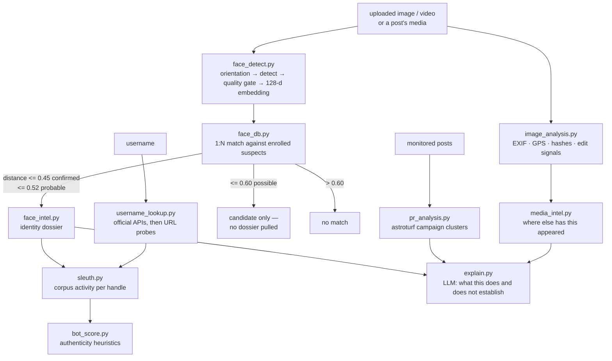

# Forensics and OSINT

The Investigate page is a set of offline analysis tools plus a small number of
official-API lookups. Nothing here uploads evidence to a third-party service.

## Image and video analysis

`app/osint/image_analysis.py` — real, offline, no external service.

**Images:** format, dimensions, size; EXIF metadata (camera make and model,
capture *and* edit timestamps, software, orientation, GPS → decimal lat/lon with
a maps link); perceptual fingerprints (64-bit dHash + aHash); and manipulation
signals — editor software tags, capture/edit-time mismatch, stripped metadata,
screenshot markers — each with a plain-English reason.

**Videos:** MP4/MOV/3GP parsed by a pure-Python box walker, **no ffmpeg
dependency**: container brand, duration, resolution, codec, estimated bitrate,
and the container's creation/modification timestamps with the same
scrubbed / re-encoded / edited-after-capture signals as images.

The perceptual hashes are the key into the media index.

## Media intelligence — "where else has this appeared"

`media_intel.py` keeps a fingerprint index of media seen circulating across the
monitored sources; reverse lookup hashes the upload and finds the nearest known
item by Hamming distance.

Appearances are split into buckets — public figures, ordinary accounts, and
suspected re-posters — because a public figure's photo naturally appears on
hundreds of accounts, and an analyst drowned in that list learns nothing.

## Face identification

Two halves, deliberately separated.

### Detection and quality (`face_detect.py`)

The earlier version called `face_recognition.face_locations()` on the raw
uploaded bytes and returned a count. That fails on exactly the material this
system handles, and produced nothing matchable. What it does now:

* **EXIF orientation is applied first.** A portrait phone photo stores its
  pixels landscape, and dlib's upright detector finds nothing in a sideways
  image — this alone was silently losing most phone uploads.
* **Large images are downscaled before detection** (HOG cost is quadratic in
  pixels) and boxes are mapped back to original coordinates, so a 12 MP photo
  costs about what a 1 MP one does.
* **Adaptive escalation:** a pass that finds nothing is retried upsampled (small
  or distant faces in crowd shots), then optionally with the CNN detector.
* Overlapping detections from different passes are merged by IoU.
* **Quality gating** — face size in real pixels, sharpness (variance of
  Laplacian), exposure — decides whether a found face is good enough to
  *identify*, as opposed to merely being found. A face can be detected and
  still be honestly reported as unusable.

### Matching (`face_db.py`)

1:N comparison of 128-d embeddings against templates enrolled per `Suspect`.
The policy is deliberately conservative, because a false positive here is an
accusation against a real person:

| Distance | Verdict | What happens |
|---|---|---|
| ≤ 0.45 | confirmed | record asserted, dossier pulled |
| ≤ 0.52 | probable | asserted, flagged for analyst confirmation |
| ≤ 0.60 | possible | returned as a **candidate only** — never an identification, no dossier |
| > 0.60 | no match | — |

dlib's own recommended operating point is 0.6; this sits below it because the
evidence is compressed social-media media rather than controlled captures. Every
result carries its **raw distance**, so an analyst sees the actual evidence
strength rather than a laundered percentage.

Templates and mugshots are encrypted at rest — see
[SECURITY.md](SECURITY.md#biometric-data).

### The dossier (`face_intel.py`)

A match is only a key. The dossier opens every drawer it unlocks: the record
(charges, case IDs, custody status, jurisdiction, risk level), the social
footprint (each known handle expanded through the sleuth dossier plus live
cross-platform enumeration for handles never seen posting), and every monitored
post from those handles, worst-first.

## Username lookup

`username_lookup.py` calls **official APIs first** and falls back to URL probes:

| Platform | Route |
|---|---|
| GitHub | REST `/users/{u}` — name, bio, avatar, followers, created |
| Reddit | OAuth `/user/{u}/about`, falling back to public `about.json` |
| X | API v2 `/users/by/username` — metrics, created |
| YouTube | Data v3 `channels?forHandle` |
| others | URL probe |

The reason is precision: a bare profile-URL probe answers "did this host return
200?", which cannot separate a real account from a placeholder, a soft-404 from
a hit, or a squatted handle from the person being investigated.

`GITHUB_TOKEN` is optional and read-only by construction — any token with no
scopes lifts the shared 60 requests/hour/IP limit to 5,000/hour.

## Account authenticity

`bot_score.py`, shared by PR analysis, comment analysis and the sleuth dossier.
Generic behavioural and string heuristics in the spirit of Botometer's feature
families — handle shape (digit runs, consonant soup), account maturity, audience
shape (near-zero followers, lopsided ratios), default identity (no display name
or avatar), posting cadence. No platform API required.

## Coordinated-campaign detection

`pr_analysis.py` finds near-duplicate clusters across three or more accounts and
scores them on message uniformity, synchronised bursts, account authenticity and
amplification.

Scope is explicit and narrow: only campaigns that touch **public order** are
surfaced. Ordinary marketing spam is filtered out — the tool exists to find
manufactured outrage, whitewashes and boycott pushes, not to police advertising.

## Explaining a report

`explain.py` asks an LLM to turn a set of findings into an argument: which
findings carry weight, which are circumstantial, and — the part that matters —
**what the report does not establish**. Each tool already reports what it found
and why; this joins them for the analyst writing the case up. It is not "send
the report to a model and print the answer": the LLM sees only findings the
tools produced, and is asked to bound them.

## The media proxy

Post media is relayed by `/api/media`, never loaded from the platform CDN
directly. Two reasons, and the second is the one that matters:

1. The dashboard's CSP is `img-src 'self' data: blob:`. Widening it to a list of
   CDN hostnames would be a permanent maintenance burden and a list of third
   parties allowed to serve bytes into an authenticated police console.
2. **Every direct load tells that CDN which post an officer is looking at, from
   which IP, and when.** For a console watching accounts that may be adversarial,
   that is an intelligence leak in the other direction.

The proxy is SSRF-guarded (`security/ssrf.py`): only public HTTP(S) hosts, no
redirects into private ranges, size-capped.

## Audio

`audio_analysis.py` transcribes uploaded audio and video locally with Whisper,
so intercepted or forwarded media can be read as text. It runs on the same
device selection as the rest of the ML stack ([GPU.md](GPU.md)).
