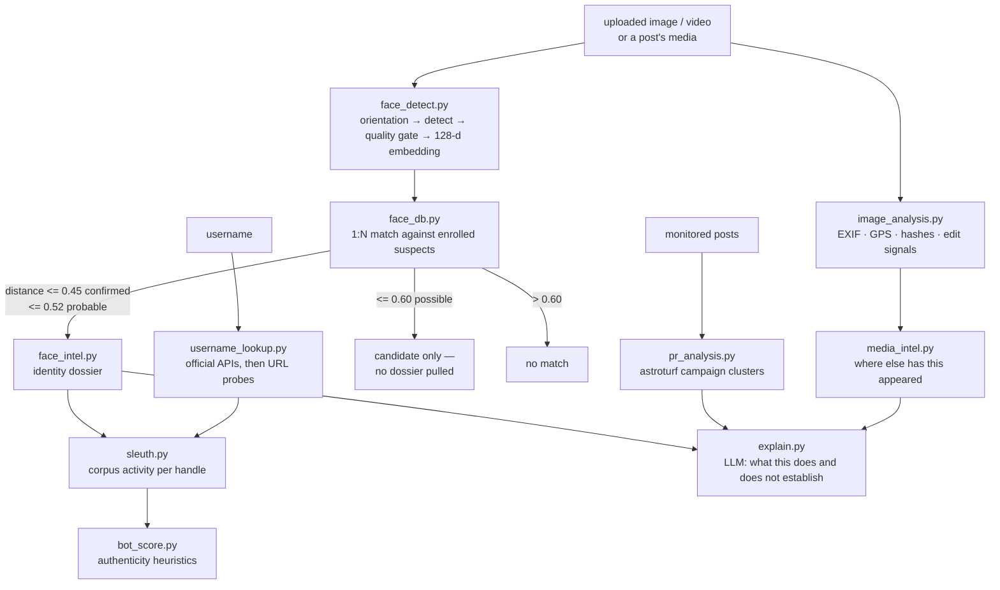

# Forensics and OSINT

The Investigate page is a set of offline analysis tools plus a small number of
official-API lookups. Nothing here uploads evidence to a third-party service.



## Image and video analysis

`app/osint/image_analysis.py` — real, offline, no external service.

**Images:** format, dimensions, size; EXIF metadata (camera make and model,
capture *and* edit timestamps, software, orientation, GPS → decimal lat/lon with
a maps link); perceptual fingerprints (64-bit dHash + aHash); and manipulation
signals — editor software tags, capture/edit-time mismatch, stripped metadata,
screenshot markers — each with a plain-English reason.

**Videos:** MP4/MOV/3GP parsed by a pure-Python box walker, **no ffmpeg
dependency**: container brand, duration, resolution, codec, estimated bitrate,
and the container's creation/modification timestamps with the same
scrubbed / re-encoded / edited-after-capture signals as images.

The perceptual hashes are the key into the media index.

## Media intelligence — "where else has this appeared"

`media_intel.py` keeps a fingerprint index of media seen circulating across the
monitored sources; reverse lookup hashes the upload and finds the nearest known
item by Hamming distance.

Appearances are split into buckets — public figures, ordinary accounts, and
suspected re-posters — because a public figure's photo naturally appears on
hundreds of accounts, and an analyst drowned in that list learns nothing.

That index covers the monitored sources. The open web is the other half:

## Reverse image search, run rather than linked (`lens_search.py`)

The question behind this tool is "where else has this photo been posted", and
the honest answer needs the whole web, not one console's index. This used to
end at four "continue your search here" buttons — which leaves the officer to
answer it by hand, and puts their own IP address on every page the photo
appears on.

Google Lens has no API and its results page needs JavaScript, so the search runs
in the same headless Chrome the Facebook collector already depends on: the image
goes in through Google's own upload control, and the visual-match cards are read
out of the rendered DOM. Results come back as pages — title, URL and domain —
in about fifteen seconds, cached by image hash so re-opening the same evidence
costs nothing.

Two things are load-bearing and both were learned the hard way:

- **The Chrome profile is persistent.** A fresh profile every run is a brand-new
  browser every run, and Google answers that with its "unusual traffic"
  interrogation page rather than results.
- **One search at a time, process-wide.** A console firing parallel headless
  browsers at Google would be blocked, permanently and deservedly.

If the profile's standing lapses — a burst of searches from one network will do
it — run `python -m app.osint.lens_login` once, which opens a visible Chrome so
an operator can clear the challenge by hand. Same arrangement, and same reason,
as `app.crawlers.facebook_login`.

Everything degrades: with Selenium absent, Chrome missing, or Google serving a
challenge, the panel reports why in plain language and the manual engine links
are still there.

## Face identification

Two halves, deliberately separated.

### Detection and quality (`face_detect.py`)

The earlier version called `face_recognition.face_locations()` on the raw
uploaded bytes and returned a count. That fails on exactly the material this
system handles, and produced nothing matchable. What it does now:

* **EXIF orientation is applied first.** A portrait phone photo stores its
  pixels landscape, and dlib's upright detector finds nothing in a sideways
  image — this alone was silently losing most phone uploads.
* **Large images are downscaled before detection** (HOG cost is quadratic in
  pixels) and boxes are mapped back to original coordinates, so a 12 MP photo
  costs about what a 1 MP one does.
* **Adaptive escalation:** a pass that finds nothing is retried upsampled (small
  or distant faces in crowd shots), then optionally with the CNN detector.
* Overlapping detections from different passes are merged by IoU.
* **Quality gating** — face size in real pixels, sharpness (variance of
  Laplacian), exposure — decides whether a found face is good enough to
  *identify*, as opposed to merely being found. A face can be detected and
  still be honestly reported as unusable.

### Matching (`face_db.py`)

1:N comparison of 128-d embeddings against templates enrolled per `Suspect`.
The policy is deliberately conservative, because a false positive here is an
accusation against a real person:

| Distance | Verdict | What happens |
|---|---|---|
| ≤ 0.45 | confirmed | record asserted, dossier pulled |
| ≤ 0.52 | probable | asserted, flagged for analyst confirmation |
| ≤ 0.60 | possible | returned as a **candidate only** — never an identification, no dossier |
| > 0.60 | no match | — |

dlib's own recommended operating point is 0.6; this sits below it because the
evidence is compressed social-media media rather than controlled captures. Every
result carries its **raw distance**, so an analyst sees the actual evidence
strength rather than a laundered percentage.

Templates and mugshots are encrypted at rest — see
[SECURITY.md](SECURITY.md#biometric-data).

### The reference gallery (`face_gallery.py`)

The registry answers "is this person on our records". The gallery answers the
other half: "do we know who this is at all".

Teaching it a face is one action — drop a photo into `pics/`, in a folder named
after the person:

```
pics/Cristiano Ronaldo/celebration.jpg
pics/Lionel Messi/messi.jpg
pics/narendra-modi.jpg          # a loose file works too
```

The photo is then **stored in the database**, not the checkout: the embedding,
a face crop and a downscaled copy go into `referenceface`, sealed with the same
key as the registry's templates. So a reference survives the file being deleted,
the repo being re-cloned, or a second console running against the same Supabase
project — and no biometric material sits in the source tree. Ingestion
deduplicates on file content, so a scan that finds nothing new writes nothing;
and because the database is the record, deleting the file does **not** delete
the person (removal is an explicit, audited action).

Same thresholds as the registry, so "confirmed" means the same evidence either
way. Measured on eight reference photos of two people:

| | distance |
|---|---|
| same person, different photo | 0.28 – 0.52 |
| different people | 0.65 and up |

which clears the 0.45/0.52 identification band with room either side. The margin
comes from holding several photos per person, not from a looser threshold.

**The two results are never merged.** A registry hit opens a criminal dossier; a
gallery hit is a name and nothing more, and is rendered as its own card reading
*known person / no criminal record*. Merging them would mean every recognised
face — a footballer in a viral photo, an officer in a crowd shot — arriving on
screen dressed as a police record.

### The dossier (`face_intel.py`)

A match is only a key. The dossier opens every drawer it unlocks: the record
(charges, case IDs, custody status, jurisdiction, risk level), the social
footprint (each known handle expanded through the sleuth dossier plus live
cross-platform enumeration for handles never seen posting), and every monitored
post from those handles, worst-first.

## Username lookup

`username_lookup.py` calls **official APIs first** and falls back to URL probes:

| Platform | Route |
|---|---|
| GitHub | REST `/users/{u}` — name, bio, avatar, followers, created |
| Reddit | OAuth `/user/{u}/about`, falling back to public `about.json` |
| X | API v2 `/users/by/username` — metrics, created |
| YouTube | Data v3 `channels?forHandle` |
| others | URL probe |

The reason is precision: a bare profile-URL probe answers "did this host return
200?", which cannot separate a real account from a placeholder, a soft-404 from
a hit, or a squatted handle from the person being investigated.

`GITHUB_TOKEN` is optional and read-only by construction — any token with no
scopes lifts the shared 60 requests/hour/IP limit to 5,000/hour.

## Account authenticity

`bot_score.py`, shared by PR analysis, comment analysis and the sleuth dossier.
Generic behavioural and string heuristics in the spirit of Botometer's feature
families — handle shape (digit runs, consonant soup), account maturity, audience
shape (near-zero followers, lopsided ratios), default identity (no display name
or avatar), posting cadence. No platform API required.

## Coordinated-campaign detection

`pr_analysis.py` finds near-duplicate clusters and reports the ones that are
actually organised. Both halves matter, and the second is where the work is:
duplication on its own proves nothing.

Four things routinely produce identical copy across "several accounts" with no
campaign anywhere in sight — one organisation posting to its own several
platforms, a press release syndicated by the desks it was sent to, the same post
collected twice, and a stock phrase everyone reaches for on the same day. Every
one of them used to be reported as *"coordinated whitewash / paid praise"*,
which on live data meant accusing the Surat City Police of running a paid
influence operation because its Instagram, Facebook and X accounts had each
carried the same arrest notice.

So a cluster now has to get past four gates:

| Gate | What it establishes |
|---|---|
| **Identity** | Handles fold to an *actor* — case and punctuation ignored — so `@amdavadamc` and `@AmdavadAMC` are one municipal corporation, not two accounts |
| **Authenticity** | Verified accounts, this deployment's own seed desks, and accounts with a large established audience are authentic public voices. A cluster made only of those is **syndication**, reported as syndication |
| **Corroboration** | At least one signal of organisation beyond the shared text: a synchronised burst, a bot-heavy roster, throwaway accounts, or the copy crossing platforms under genuinely different actors |
| **A floor** | Below `MIN_CONFIDENCE` nothing is reported, because a weak flag on this screen reads exactly like a strong one |

Every cluster the detector saw is accounted for on screen — as a campaign, as
neutral, as syndication, or as having no coordination signal — so an empty
result cannot be confused with a detector that did not run.

On the live corpus this took a 168-hour window from **46 "campaigns", mostly
police and civic desks**, down to 3 — while the one genuine astroturf cluster in
that window (eight throwaway accounts, identical 52-word copy, inside twenty
minutes) survives every gate at 80% confidence. `tests/test_pr_campaigns.py`
pins each of those cases.

Scope stays explicit and narrow: only clusters that touch **public order** are
surfaced, and no label asserts that anyone was paid — nothing measured here
could establish that.

## Explaining a report

`explain.py` asks an LLM to turn a set of findings into an argument: which
findings carry weight, which are circumstantial, and — the part that matters —
**what the report does not establish**. Each tool already reports what it found
and why; this joins them for the analyst writing the case up. It is not "send
the report to a model and print the answer": the LLM sees only findings the
tools produced, and is asked to bound them.

## The media proxy

Post media is relayed by `/api/media`, never loaded from the platform CDN
directly. Two reasons, and the second is the one that matters:

1. The dashboard's CSP is `img-src 'self' data: blob:`. Widening it to a list of
   CDN hostnames would be a permanent maintenance burden and a list of third
   parties allowed to serve bytes into an authenticated police console.
2. **Every direct load tells that CDN which post an officer is looking at, from
   which IP, and when.** For a console watching accounts that may be adversarial,
   that is an intelligence leak in the other direction.

The proxy is SSRF-guarded (`security/ssrf.py`): only public HTTP(S) hosts, no
redirects into private ranges, size-capped.

## Audio

`audio_analysis.py` transcribes uploaded audio and video locally with Whisper,
so intercepted or forwarded media can be read as text. It runs on the same
device selection as the rest of the ML stack ([GPU.md](GPU.md)).
