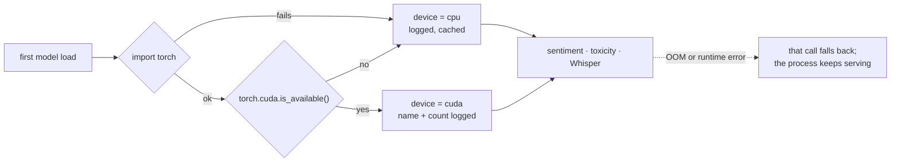

# Running on a GPU

Nothing needs configuring. `app/ml/device.py` detects CUDA at first use, caches
the answer, and every transformer — sentiment, toxicity, Whisper transcription —
loads onto whatever it finds. With no GPU the same code runs on CPU.



## What is accelerated, and what is not

| Component | Device | Speedup vs CPU |
|---|---|---|
| Sentiment (MuRIL fine-tune) | GPU when present | ~10-30× |
| Toxicity model | GPU when present | ~10-30× |
| Fine-tuning (`train_sentiment.py`) | GPU when present | ~5-20× |
| Whisper transcription | GPU when present | large on long audio |
| TF-IDF + LinearSVC | CPU always | n/a — it is a linear model |
| Lexicon model | CPU always | n/a |
| **Face detection / matching** | **CPU always** | dlib's HOG and CNN detectors are CPU-only here; embedding comparison is NumPy and is well optimised across cores |

Face work being CPU-bound is worth knowing before sizing a host: a GPU does not
make face search faster in this build. For GPU-accelerated detection you would
swap the backend for something like InsightFace, which is not vendored here.

## Installing

**The bootstrap does it for you** — it tries the CUDA wheel index first and
falls back to the CPU build:

```bash
cd backend
python -m app.ml.bootstrap
```

**Manual, if you want control:**

```bash
# NVIDIA GPU
pip install torch --index-url https://download.pytorch.org/whl/cu128

# CPU only
pip install torch
```

Prerequisites for the CUDA path: an NVIDIA GPU (compute capability 3.5+),
current drivers, and CUDA toolkit 12.1+. cuDNN ships inside the PyTorch wheels.

## Verifying

```bash
cd backend
python -m app.ml.check_device
```

or directly:

```bash
python -c "import torch; print(torch.cuda.is_available(), torch.cuda.get_device_name(0) if torch.cuda.is_available() else 'CPU')"
```

At startup the log says which device was chosen, once:

```
GPU available: NVIDIA A100-PCIE-40GB (1 device(s))
```
```
No GPU detected, using CPU
```

If detection itself raises, the exception is logged and the device defaults to
CPU — a broken CUDA install degrades the service rather than stopping it.

## Troubleshooting

**"No GPU detected" with a GPU installed**
1. `nvidia-smi` — does the driver see the card?
2. `nvcc --version` — is the toolkit installed?
3. `python -c "import torch; print(torch.__version__, torch.version.cuda)"` — a
   version with no CUDA suffix means the CPU wheel is installed. Reinstall from
   the CUDA index (above).

**Out of memory during training**
* smaller batch: `--batch 8` instead of 16
* shorter sequences: `--max-len 64` instead of 128
* inference falls back automatically; training does not — it is meant to fail
  loudly so you fix the batch size rather than silently train differently.

**Windows: MAX_PATH during dataset download.** Some Hugging Face cache paths
exceed 260 characters. Enable long paths, or clone nearer the drive root.

## Relevant files

| File | Role |
|---|---|
| `app/ml/device.py` | detection, caching, logging |
| `app/ml/check_device.py` | the diagnostic command |
| `app/ml/transformer_engine.py` | passes the device to every HF pipeline |
| `app/ml/train_sentiment.py` | training device + batch flags |
| `backend/requirements-ml.txt` | the ML stack, installed separately from the API deps |
