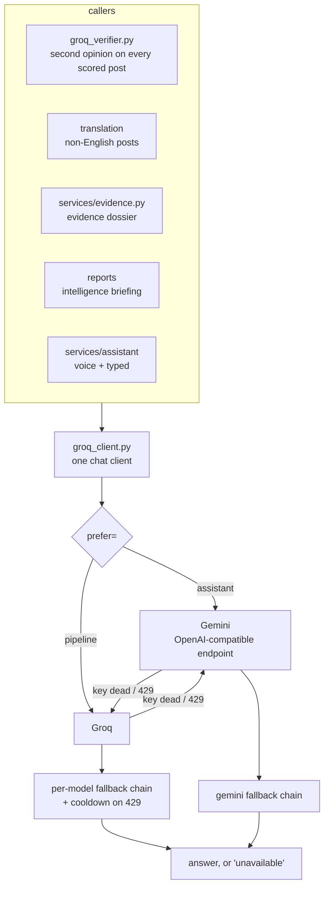

# The LLM layer — Groq, Gemini, and news corroboration

Five features in this system call a language model, and all of them go through
one client (`app/services/groq_client.py`) so they inherit the same fallback
chain, the same cooldowns and the same honest-failure behaviour.



## Two providers, split by workload

The split is by workload, not preference:

* **Groq runs the post pipeline** — verification, translation, dossiers. High
  volume, batch, latency-invisible. The per-model daily budgets and cooldown
  chain are exactly the right shape for it.
* **Gemini runs the assistant** — voice and typed. Low volume, latency-visible,
  and the one surface where a drained quota is felt live by an officer
  mid-sentence.

Giving them separate providers means they cannot starve each other: a heavy
ingestion tick cannot mute the assistant, and a long assistant session cannot
eat the budget the feed needs. Each remains the other's fallback, so a dead key
degrades a feature instead of removing it.

Gemini is reached through Google's **OpenAI-compatible endpoint**, so request
and response shapes — tool calls included — are the ones `groq_client` already
builds and parses.

## Per-model fallback and cooldown

Groq's free-tier limits (RPM/TPM/TPD) are tracked **per model**, so when the
primary model's daily budget drains with a 429, the same request usually
succeeds on a sibling whose quota is untouched. Every call walks
`GROQ_FALLBACK_MODELS`.

A model that 429s is put on **cooldown** — parsed from the error's "try again in
Xs" hint when present, otherwise 10 minutes, capped at 30 — so background loops
stop hammering a drained model every tick.

**Tool-calling models are a separate, narrower list** (`GROQ_TOOL_MODELS`,
`GEMINI_TOOL_MODELS`). A model that ignores the `tools` parameter answers from
memory, and an assistant whose safety rests on "it only sees what tools return"
must never do that.

Model ids are aliases rather than pinned versions on purpose: Google retires
dated ids for new keys (`gemini-2.5-flash` already 404s for new users) and an
alias keeps working across that.

## There is no local-model tier

An Ollama leg used to sit at the end of the chain for air-gapped installs. It
was removed: this deployment is a hosted web service, so "a model on this
machine" means CPU inference on the web host, on the request path, competing
with the API, with nobody nearby to `ollama pull` when it 404s. With no key at
all the LLM-backed features report themselves off rather than degrading quietly.

## 1. Verification — the fourth opinion

`app/services/groq_verifier.py`. After the three models have voted and the score
is computed, Groq sees the post and the ensemble's verdict.

* Agreement → confidence raised.
* Disagreement at confidence ≥ **0.75** (`GROQ_OVERRIDE_CONFIDENCE`) → the label
  is replaced, and stored **as an override**, never silently.
* Disagreement below that → stored as a dissent; the label stands.

Budgeted at `GROQ_MAX_PER_TICK` (8) and only for posts scoring above
`GROQ_VERIFY_MIN_SCORE` (55) — the LLM's opinion is worth paying for on the posts
an analyst might act on, not on every routine post.

It is a **check, not a fourth vote**: it reviews a decision that has already been
made, and its dissent is recorded even when it loses.

## 2. Translation

Live non-English posts are machine-translated during enrichment, on
`GROQ_MODEL_FAST` (the 8B model) so the big model's daily budget stays available
for analyst-triggered work. The translation is stored alongside the original —
never in place of it — and geo-tagging reads both.

## 3. Evidence dossiers and briefings

`services/evidence.py` assembles a per-post dossier; `/reports/briefing`
generates a one-paragraph tactical summary of the last N hours for a commander.
Both are analyst-triggered, so they use the full-size model.

## 4. The assistant

Covered in [VOICE.md](VOICE.md) for the audio path. The agent itself
(`app/services/assistant/`) is a tool-calling loop with three properties that
matter more than its model choice:

* **A deterministic rules layer answers the nine most common questions with no
  model involved at all.** Turning the LLM off leaves those working.
* **Tools are rank-filtered**, and the filter is applied twice — once to decide
  what the model is *shown*, once to decide what actually *runs*. A bug in the
  first must not become a privilege escalation in the second.
* **The read-only SQL sandbox** (`assistant/sandbox.py`) is restricted to three
  views of structured columns, enforced by the database as well as by a
  validator. It cannot reach post text, accounts, the audit trail or the
  registry. `ASSISTANT_SQL_ENABLED=false` leaves the assistant with curated
  tools only.

## 5. News corroboration

`app/services/fact_check.py`. Three tiers, queried in order and merged:

| Tier | Cost | Used by |
|---|---|---|
| Google News RSS | keyless, unmetered | the background ingest loop |
| GNews | 100 req/day free | analyst-triggered only, capped at `GNEWS_DAILY_BUDGET` (80) |
| NewsAPI.org | 100 req/day free | analyst-triggered only, capped at `NEWSAPI_DAILY_BUDGET` (80) |

Two independent indexes agreeing on a story is corroboration; one index having
it is a search result — which is why the second key is worth having at all.

A missing key drops that tier from the walk, and the evidence block then names
only the sources that actually answered. It never implies coverage it did not
get. **This is corroboration, not fact-checking**: the system reports who else
is carrying the story, and does not assert that the story is true or false.

## Keys

All optional; every one of them absent is a supported configuration.

```env
GROQ_API_KEY=          # console.groq.com — free
GEMINI_API_KEY=        # assistant; without it the assistant uses Groq
GNEWS_API_KEY=         # gnews.io
NEWSAPI_KEY=           # newsapi.org
```

They belong in `backend/.env`, which is gitignored. `config.py` is not — a key
committed there is a key published.
