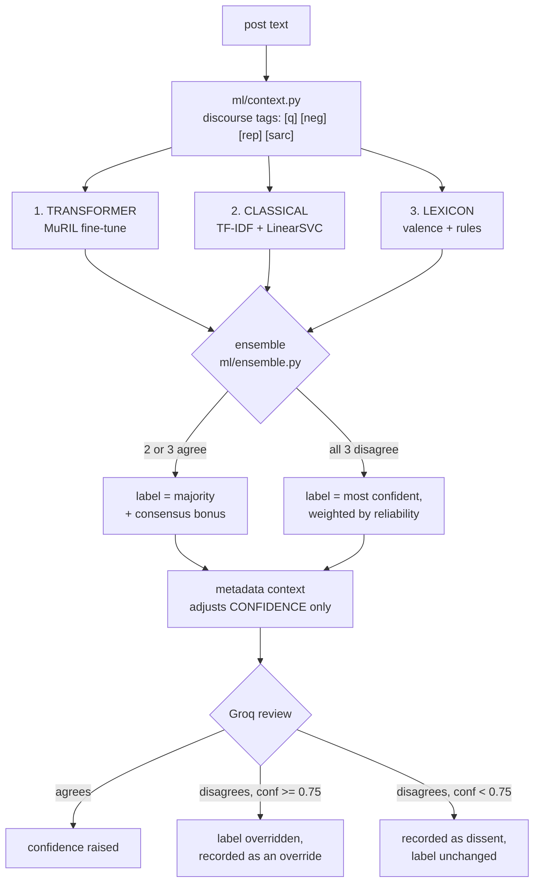
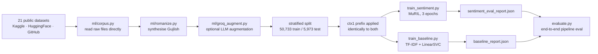

# The three models

Every post gets exactly one label — **positive**, **negative** or **neutral** —
and that label is a vote, not a verdict. Three models with three different
failure modes each predict it independently, the ensemble decides, and an LLM
reviews the decision afterwards.

The reason for three is not accuracy for its own sake. A single model that is
70% right is also 30% wrong *silently*: nothing in its output tells an analyst
which 30%. Three models that disagree tell you exactly where the answer is
soft, and that disagreement is stored on the post and shown in the UI.



## Why these three

They are chosen to fail differently. Three transformers would agree with each
other and with their shared pre-training bias; these three do not share one.

### 1. Transformer — `google/muril-base-cased`, fine-tuned

`app/ml/transformer_engine.py`, trained by `app/ml/train_sentiment.py`.

MuRIL is Google's multilingual model pre-trained on 17 Indian languages
*including transliterated text*, which is the reason it is the base here rather
than mBERT or XLM-R: half the traffic in a Gujarat city feed is romanized
Gujarati and Hindi, and a model that has never seen "bau saru chhe" written in
Latin script has to guess. (The original choice was `ai4bharat/indic-bert`; it
became a gated Hugging Face repo requiring login, which made a one-command
clone-and-train impossible.)

* **Sees:** the full post text with the context prefix, as one sequence.
* **Strength:** word order and long-range structure — negation scoped over a
  clause, contrast ("સરસ છે, પણ..."), sarcasm marked by discourse cues.
* **Weakness:** confidently wrong on domain-shifted text; expensive; needs a
  GPU to train in reasonable time ([GPU.md](GPU.md)).
* **Measured** (`app/ml/sentiment_eval_report.json`, 5,973 held-out rows):
  accuracy **0.705**, macro-F1 **0.704**.

### 2. Classical — TF-IDF + LinearSVC

`app/ml/linear_model.py`, trained by `app/ml/train_baseline.py`.

Word 1-2-grams **and character 2-5-grams**. The character n-grams are what make
this model worth keeping: they survive spelling chaos that destroys word
features — "bhaiiii", "nhi/nahi/nai", Gujarati typed in three different
romanizations — because a character 4-gram of a misspelt word still overlaps
the correctly spelt one.

* **Sees:** the same context-tagged text, vectorised.
* **Strength:** stable, fast, no GPU, and its decision is inspectable — you can
  ask which n-grams moved it.
* **Weakness:** no word order at all; "not good" and "good, not bad" look alike.
* **Measured** (`app/ml/baseline_report.json`, same split): accuracy **0.647**,
  macro-F1 **0.648**.

### 3. Lexicon — multilingual valence + rules

`app/ml/classifier.py` with `app/ml/lexicons.py`.

A hand-curated valence lexicon across all five language forms plus VADER-style
rules for negation, intensifiers, and emoji. It is the weakest of the three and
the only one that can *explain itself in a sentence* — "matched 'ખરાબ' (-0.6),
negated by 'નથી'" — which is what the evidence drawer shows an analyst.

* **Strength:** zero training, fully explainable, no domain shift, works when
  the ML stack is unavailable (`NLP_MODE=lite` runs this alone).
* **Weakness:** blind to anything not in the lexicon; no composition.
* **Reliability prior:** 0.560 (`MODEL_WEIGHTS` in `ensemble.py`).

## Per-language accuracy — where each model is actually good

Both trained models were evaluated per language form on the same 5,973-row
held-out split. This table is the honest picture of what the system knows:

| Language | rows | Transformer acc / F1 | Classical acc / F1 |
|---|---:|---|---|
| Gujarati (script) | 229 | **0.838** / 0.664 | 0.764 / 0.678 |
| Gujlish (romanized Gujarati) | 800 | **0.828** / 0.787 | 0.759 / 0.697 |
| Hindi (Devanagari) | 1,144 | **0.740** / 0.720 | 0.668 / 0.655 |
| English | 2,000 | **0.687** / 0.678 | 0.611 / 0.605 |
| Hinglish (romanized Hindi) | 1,800 | **0.632** / 0.631 | 0.611 / 0.613 |
| **Overall** | **5,973** | **0.705** / 0.704 | 0.647 / 0.648 |

Two things worth reading off it. The transformer beats the baseline in every
single language form, which is why it carries the highest reliability weight
(0.706 vs 0.640). And **Hinglish is the hardest class for both models** — it is
the most lexically ambiguous form, sharing tokens with English while meaning
something else, and it is also the highest-volume form in a real city feed. A
low score there is the main reason the ensemble and the LLM review exist rather
than a single classifier.

Gujarati's high accuracy with a much lower macro-F1 is a class-imbalance
artefact of a small (229-row) slice — it is good at the majority class there
and thin on the rest. Do not read 0.838 as "solved".

## The shared context prefix — why all three must be retrained together

Every model reads the **same** input, produced by `ml/context.py`: the post text
with a short deterministic tag prefix describing its discourse structure —
interrogative, negated, reported speech, contrastive, sarcasm cues.

This matters because of what a training corpus is. The 21 public datasets used
here are plain `(text, label)` rows with no author, no platform and no reach, so
any feature needing metadata could never be learned. Discourse structure *can*
be derived from text alone, so it is rendered into the input identically in
`train_sentiment.py`, `train_baseline.py` and at inference, and both models
learn what `[q]` implies instead of being handed a flag they have never seen.

The prefix is **version-stamped** (`ctx1`, recorded in both report files). An
ensemble where one model was trained with the prefix and the other without it is
two models answering different questions, so:

> Retrain both together. `python -m app.ml.bootstrap` does that in one command.

## The decision rule

`app/ml/ensemble.py`:

1. **Two or three agree** → that label wins. Confidence is the mean of the
   agreeing models plus a consensus bonus.
2. **All three disagree** → the single most confident model wins, weighted by
   its historical reliability (`MODEL_WEIGHTS`, taken from the eval reports).
3. **Metadata context** (`MetaContext`: account age, verification, follower
   count, amplification, geo) then adjusts the **confidence only, never the
   label**, and every adjustment carries a human-readable reason.
4. **Groq reviews** the post and the ensemble's verdict. Agreement raises
   confidence. Disagreement at confidence ≥ `GROQ_OVERRIDE_CONFIDENCE` (0.75)
   replaces the label and is stored as an override; below that it is stored as
   a dissent and the label stands.

Step 3 is the rule that keeps this defensible. Metadata is excellent evidence
about *reach* and terrible evidence about *sentiment* — a burner account is not
more negative, it is more suspicious — so it moves how sure the system is, and
never what it says.

## What is stored, and why

Every vote, every context adjustment and Groq's verdict are written onto the
post (`class_probs`, `sentiment_consensus`, `llm_verification`). The evidence
drawer reconstructs the whole decision from those fields. That is a
chain-of-custody requirement, not a debugging nicety: an analyst acting on a
label must be able to see that two models said negative, one said neutral, and
the LLM agreed — before they act.

## Training

```bash
cd backend
python -m app.ml.bootstrap        # datasets + both models + eval, one command
```

The pipeline it runs:



Notes that save time:

* The corpus is read from the **raw** downloaded files; there is no intermediate
  JSONL to regenerate or keep in sync.
* Gujlish rows are synthesised by transliterating Gujarati-script rows
  (`ml/romanize.py`) because almost no labelled romanized-Gujarati corpus exists
  publicly. That is why Gujlish scores well: the training data was built for it.
* `groq_augment.py` is optional and skippable (`--skip-groq`), takes 2-3 hours
  on the free tier, and is resumable.
* Trained weights (~900 MB) are gitignored. A teammate re-runs bootstrap rather
  than pulling them.
* On Windows, long dataset paths can exceed MAX_PATH — enable long paths or
  clone nearer the drive root.

## Model artefacts and where the UI reads them

`app/services/model_info.py` exposes what each model is, its reliability weight,
and its eval numbers, so the Settings page shows the live picture rather than a
hard-coded card. If a fine-tuned model is missing, the pipeline falls back to
generic models and says so there.
