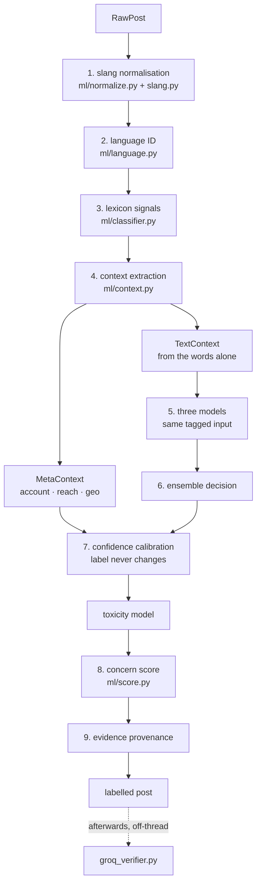

# The NLP pipeline

One entry point — `enrich(raw)` / `enrich_batch(raws)` in `app/ml/pipeline.py` —
used by ingestion, seeding and evaluation alike. Every post leaves it with one
label, one 0-100 score, and the evidence behind both.

## Language identification

`app/ml/language.py` recognises five forms plus a mixed class, with no
third-party dependency:

| Form | How it is detected |
|---|---|
| Gujarati | Unicode block U+0A80–U+0AFF ≥ 30% of letters |
| Hindi | Devanagari U+0900–U+097F ≥ 30% of letters |
| Hinglish | Latin-dominant + romanized **Hindi** marker words |
| Gujlish | Latin-dominant + romanized **Gujarati** marker words |
| English | Latin-dominant, no markers |
| Mixed | two Indic scripts together, or Indic + substantial Latin |

Three details that were each a real bug:

* **Hashtags do not vote.** A Gujarati caption ending in twenty Latin hashtags
  was being filed as English, which cost it its translation and its code-mixed
  flag — and most Instagram and Facebook captions look exactly like that.
  Hashtags are stripped before the script ratio is taken (they are collected
  separately anyway); a caption that is *only* hashtags keeps them, since there
  is nothing else to read.
* **Elongation is collapsed** before marker lookup, so "talagaaaaa" matches
  "talaga".
* **Filipino text vetoes the Hinglish call.** Real feeds surface Tagalog, which
  shares tokens ("wala", "ko", "na") with the romanized-Hindi markers; matching
  posts fall through to English rather than being mislabelled Hinglish.

Marker lists are split per source language, which is what separates Hinglish
from Gujlish — the same mechanism, two vocabularies.

## Translate, never filter

Non-English posts are **never dropped at collection time**, and language is
never used as a collection filter. Doing so would be an evasion route: anyone
who wanted to avoid monitoring would simply post in the script the filter
excludes.

Instead, live non-English posts get a machine translation during enrichment
(Groq, on the cheap model — see [LLM.md](LLM.md)), and geo-tagging reads **both**
the original text and the translation. `infer_city` only knows Latin, Gujarati
and Devanagari spellings of the four target cities, so a post written in any
other language would otherwise land with no location and disappear from the geo
view.

## Context extraction

`app/ml/context.py` splits context in two, and the split is the important part.

**`TextContext` — derived from the post text alone.** Interrogative, negated,
reported speech, contrastive, sarcasm cues, quoted material. Rendered as a short
deterministic tag prefix and prepended to the model input *identically at
training and inference time*. This is what lets both trained models learn what
`[q]` or `[rep]` implies rather than being handed a flag they never saw during
training. See [MODELS.md](MODELS.md#the-shared-context-prefix--why-all-three-must-be-retrained-together).

Why it exists: "આ રસ્તો ખરાબ છે" and "કોણ કહે છે આ રસ્તો ખરાબ છે? બિલકુલ સરસ છે" share
almost every token and have opposite sentiment. Nothing in the bag of words
distinguishes them.

**`MetaContext` — author, platform, reach, geo.** Known only at inference, so it
can never be in the model input. It is applied afterwards as a bounded
calibration of the ensemble's **confidence**, and every adjustment returns a
human-readable reason for the drawer. A verified municipal account posting
"water supply disrupted in Katargam" is informational; the same sentence from a
month-old account amplified 40× is a grievance riding a coordinated push — and
that difference belongs in how sure the system is, not in what it says.

## Toxicity

`app/ml/toxicity.py` runs a separate model for abusive/hateful language
intensity. It is a distinct axis from sentiment on purpose: a post can be
strongly negative and perfectly civil (a polite complaint about a road), or mild
and abusive. The concern score weights them separately (0.50 vs 0.22).

## Engine modes

`NLP_MODE=full` (default) runs the fine-tuned MuRIL head plus the toxicity
model. `NLP_MODE=lite` runs the lexicon model alone — no torch, no downloads.
Any transformer failure falls back to lite **for that call only**, so one bad
input cannot take the pipeline down for the rest of the process.

## Deduplication and identity

`ingestion.py` hashes `platform | author_handle | text` into `content_hash` and
refuses duplicates. This is why a crawler re-reading the same page across
scrolls, or across cycles, does not multiply rows — and why the Facebook scraper
can afford to parse the page on every scroll.

## Downstream consumers

| Consumer | What it reads |
|---|---|
| `services/trend_service.py` | keyword/hashtag velocity, emerging-term detection |
| `services/emerging.py` | rumour window, primed into cache each tick |
| `services/network_service.py` | author graph, clusters, amplification |
| `services/evidence.py` | the dossier assembled for a post |
| `services/report_service.py` | PDF/XLSX reports |
| `services/notifications.py` | Twilio WhatsApp alerts above the band |
