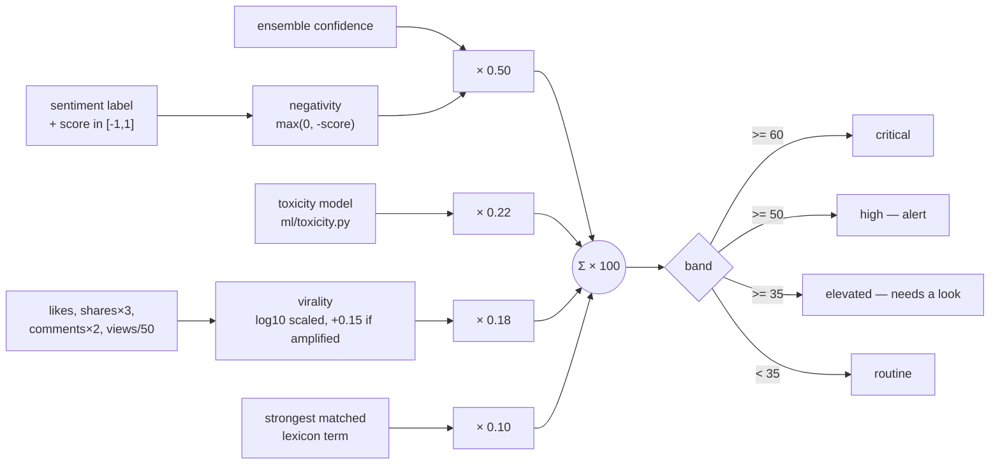

# The concern score

Every post carries a number from 0 to 100. It is the only number the alert
bands read, and it is derived entirely from sentiment — not from a claim about
what the post *is*.

```
concern = 100 × clamp01(
      0.50 × negativity × confidence     how negative, scaled by how sure
    + 0.22 × toxicity                    abusive / hateful language intensity
    + 0.18 × virality                    log-scaled reach + amplification
    + 0.10 × term_severity )             strongest matched lexicon term

negativity = max(0, −sentiment_score)    positive posts contribute exactly 0
```

Source: `app/ml/score.py`.

## Why it is shaped this way

The weights are chosen so that **no single dimension can reach an alert band on
its own**:

* A furious post nobody read tops out near 50.
* A viral cheerful post cannot climb past about 30.
* Only *negative **and** travelling* clears 50.

That property is the whole point. An analyst's time is the scarce resource in a
control room, and a queue that fills with loud-but-unread posts, or with viral
but harmless ones, trains people to ignore the queue.



### The virality term

```python
raw = likes + 3×shares + 2×comments + views/50
virality = min(1, log10(1 + raw) / 4)      # +0.15 when amplification is detected
```

Shares weigh three times a like because a share is a decision to spread. The
log scale is what stops one viral post from dominating the whole feed's
distribution: the difference between 100 and 1,000 interactions moves the term
by 0.25, and between 10,000 and 100,000 by another 0.25.

## The bands, and why they were changed

Configurable via `CRITICAL_THRESHOLD`, `ALERT_THRESHOLD`, `ELEVATED_THRESHOLD`.

| Band | Current | Was |
|---|---:|---:|
| critical | ≥ 60 | ≥ 74 |
| high (alert) | ≥ 50 | ≥ 65 |
| elevated | ≥ 35 | ≥ 50 |

The original numbers were unreachable. Across 8,203 scored posts the highest
concern score ever produced was **66.1** — so CRITICAL caught nothing at all and
ALERT caught one post. A band nothing can enter is indistinguishable from a
quiet week, which is the worst way for a monitoring tool to fail.

The formula was not at fault, and was not changed. Every component is observed
at its own ceiling somewhere in the corpus (negativity 50/50, toxicity 21.9/22,
reach 18/18). What no single post has is all of them at once: only 33 posts were
both strongly negative and toxic, and 85% of those were effectively unread — so
the reach term contributes almost nothing to exactly the posts the bands exist
to catch.

At the current values the funnel is:

| Band | Posts | Share |
|---|---:|---:|
| ≥ 60 critical | 3 | 0.04% |
| ≥ 50 high | 34 | 0.41% |
| ≥ 35 elevated | ~200 | 2.4% |

Raise them again once reach is collected properly — without `REDDIT_CLIENT_ID`,
93% of Reddit posts arrive with no engagement at all and score with a
structurally zero reach term.

## What this score is not

It is **not** a threat classification. This system once had four threat labels —
incitement, misinformation, communal, and so on — and they were removed
deliberately. A sentiment model reading one post cannot know whether a sentence
will incite violence or whether a claim in it is false; those are investigative
conclusions that need context the post does not contain. Asserting them from a
classifier produces confident, official-looking, unfalsifiable output — the
worst possible failure mode for a police tool.

What remains is defensible: *this post is negative, we are this sure, its
language is this abusive, and it travelled this far.* An officer draws the
conclusion.

The old `threat_label` column still exists in the table for historical rows and
is not written by the current pipeline.

## Reading a score in the UI

The evidence drawer shows the arithmetic, not just the total: each term's
contribution, the three model votes behind `negativity × confidence`, the
metadata adjustments that moved confidence and why, and the LLM's verdict. A
score you cannot decompose is a score nobody should act on.

## Related

* [MODELS.md](MODELS.md) — where `sentiment_score` and `confidence` come from
* [LLM.md](LLM.md) — how the LLM review can change the label behind the score
* `ALERT_THRESHOLD` in `backend/app/config.py` — the measurements above, in situ
