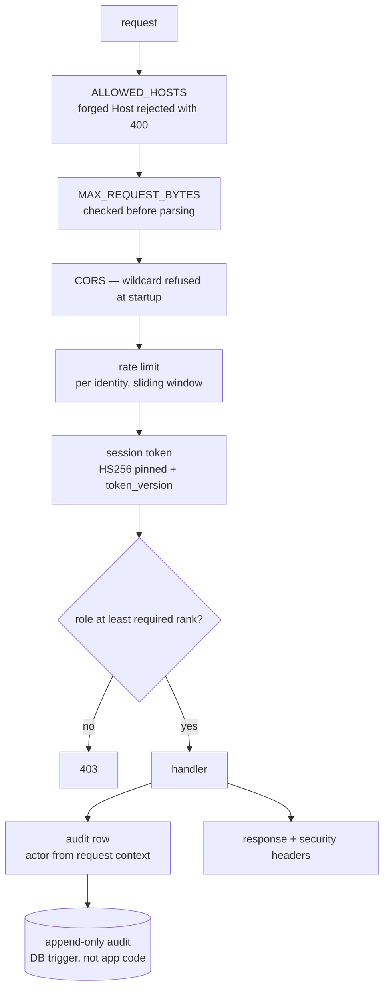

# Security and administration

This API serves criminal records. The posture below is what that implies, and
every item names the failure it exists to prevent.



## Authentication

Signed session tokens (`security/tokens.py`), with two decisions worth naming:

* **The decode call pins `algorithms=["HS256"]`.** Accepting whatever the
  token's own header asks for is the classic JWT break — `alg: none`, or
  RS256→HS256 confusion. The verifier decides the algorithm, not the token.
* **`ver` carries the user's `token_version`.** Deactivating a user or forcing a
  logout bumps that column, and every token already in the wild stops verifying
  on the next request. Without it, revocation would only take effect when the
  token expired on its own.

`SECRET_KEY` **must** be set in production. Empty means a random key at boot:
sessions die on every restart and multi-worker deployments break outright —
loud by design.

```bash
python -c "import secrets; print(secrets.token_urlsafe(48))"
```

Tokens live `ACCESS_TOKEN_TTL_MINUTES` (8 hours — one shift).

## Passwords

scrypt from the standard library (`security/passwords.py`). Memory-hard, so a
stolen hash costs an attacker RAM per guess rather than only CPU, and
dependency-free — no passlib/bcrypt wheel to audit, patch, or find broken after
a Python upgrade.

Hashes are self-describing (`scrypt$N$r$p$salt$hash`), so the work factor can be
raised later while old hashes still verify; `needs_rehash` reports which should
be upgraded on the user's next successful login.

**Brute force:** `LOGIN_MAX_ATTEMPTS` (5) then `LOGIN_LOCKOUT_MINUTES` (15).
The login endpoint has its own budget (`RATE_LIMIT_LOGIN`, 10 per 5 min, per
client IP, unauthenticated).

## The shipped administrator

`BOOTSTRAP_ADMIN_USERNAME` / `BOOTSTRAP_ADMIN_PASSWORD` create an admin at first
boot if one does not exist, and are then **left alone forever** — a password
changed in the Admin Panel is never reverted on the next restart.

The built-in default is a **known, published credential**: it ships in
`config.py`, which is in the repository. It exists so a fresh deployment has a
working sign-in, and the server logs a loud warning at every boot while it is
still in use. Set `BOOTSTRAP_ADMIN_PASSWORD` in `backend/.env` before the
instance holds real case data.

## Roles

Three ranks, strictly ordered. Every check is "at least this rank", never an
exact-match list, so adding a rank above `admin` later cannot silently strip
permissions from the ranks below it.

| Rank | Can |
|---|---|
| `analyst` | read the feed, run investigations, search faces, create and enrol registry records, generate reports |
| `supervisor` | everything above, plus the irreversible calls — deleting registry records, escalating alerts, bulk export, triggering crawls |
| `admin` | everything, plus user management, retention purges and the operations toolkit |

## Rate limits

In-process sliding window (`security/ratelimit.py`). A sliding window rather
than a fixed one, because a fixed window lets a caller spend the whole budget at
0:59 and again at 1:01.

| Budget | Default | Applies to |
|---|---|---|
| `RATE_LIMIT_DEFAULT` | 300/60 | ordinary reads |
| `RATE_LIMIT_LOGIN` | 10/300 | unauthenticated, per client IP |
| `RATE_LIMIT_EXPENSIVE` | 20/60 | face search, OSINT fetches, LLM calls |
| `RATE_LIMIT_ASSISTANT` | 40/60 | the assistant, separate so a hot mic cannot eat an analyst's quota |

**Stated honestly:** counters live in this process's memory. That is correct for
a single-instance deployment and for slowing brute force and runaway clients. It
is **not** a distributed limiter — two workers each enforce their own budget.
Moving to gunicorn or Kubernetes means moving these counters to Redis; the
`Limiter` interface is what you would reimplement.

## Transport and headers

* **`ALLOWED_HOSTS`** — anything else gets a 400 before the request reaches a
  route. A forged Host header otherwise poisons absolute URLs in generated links
  and password-style flows. `"*"` is tolerated only while `SIMULATION_ENABLED`;
  on a live deployment it is refused at startup.
* **`CORS_ORIGINS`** — a wildcard is **rejected at startup**. With credentialed
  requests, `*` lets any site an officer visits drive this API as them.
* **`MAX_REQUEST_BYTES`** (25 MB) — enforced before parsing. Uploads to the
  image and face tools are the only large bodies this API legitimately sees.
* **`ENABLE_HSTS`** — off by default because it is actively harmful over plain
  HTTP on localhost (the browser pins the host to https for a year). Turn it on
  the moment this sits behind TLS.
* **`TRUST_PROXY_HEADERS`** — off unless a reverse proxy you control sets
  `X-Forwarded-For`; otherwise callers forge their own audit-log IP.

## Outbound requests (SSRF)

The investigation tools fetch URLs an analyst pastes in, and those URLs come
from hostile content by definition. Without a guard, "analyse this link" means
"make my server issue a request to any address it can reach" — which on a police
network is the internal one.

`security/ssrf.py` blocks private, loopback, link-local, multicast and reserved
ranges, and the cloud metadata address (169.254.169.254 / fd00:ec2::254), on the
resolved address and on every redirect hop.

## Biometric data

Face templates are **irrevocable**. A leaked password is rotated in a minute; a
leaked face vector identifies that person for life, and the registry it sits in
marks them as a criminal suspect. That asymmetry is why templates and mugshots
get their own encryption layer rather than relying on filesystem permissions
around `sentinel.db`.

Fernet (AES-128-CBC + HMAC-SHA256) — authenticated, so a tampered ciphertext
fails loudly rather than decrypting to a subtly wrong vector that would quietly
change who a search matches.

```bash
python -c "from cryptography.fernet import Fernet; print(Fernet.generate_key().decode())"
# -> BIOMETRIC_ENCRYPTION_KEY in backend/.env
```

Unset means biometrics are stored in the clear — allowed for a local demo,
**refused when `SIMULATION_ENABLED=false`**.

Scope, stated plainly: this protects the database at rest — a stolen laptop, a
copied backup, a misconfigured share. It does **not** protect against an
attacker with code execution on the running server, since the process must hold
the key to do its job. Defence against that is authentication and the audit log.

## Audit trail

Every escalation, report, OSINT lookup, registry change and admin action writes
an audit row. Two properties:

* **Attribution is automatic.** The actor is filled in from the request context,
  so it is not something a call site can forget. Background work is stamped
  `system`, never an officer's name.
* **Append-only is enforced by the database**, with triggers created on both
  SQLite and Postgres — not by application code that a future bug could bypass.

Audit writes are best-effort *with respect to the caller*: a failure is logged
loudly but never turns a successful police action into a 500. That trade-off
favours availability of the tool over completeness of the log, and is worth
naming rather than discovering.

## The admin panel

| Action | Rank | Endpoint |
|---|---|---|
| System status (sources, models, LLM quotas) | admin | `/api/admin/system` |
| Test the LLM chain | admin | `/api/admin/test-llm` |
| Translate untranslated posts | admin | `/api/admin/translate-missing` |
| Re-label languages | admin | `/api/admin/relabel-languages` |
| Re-analyse posts through the current pipeline | admin | `/api/admin/reanalyse` |
| Retrain the baseline model | admin | `/api/admin/retrain-baseline` |
| Trigger a crawl now | supervisor | `/api/admin/crawl-now` |
| Bulk export | supervisor | `/api/admin/export` |
| Retention purge | admin | `/api/admin/purge` |
| User management | admin | `/api/auth/users` |
| Security posture readout | admin | `/api/auth/security-posture` |
| Audit trail | admin | `/api/auth/audit` |

`/api/health` is unauthenticated and deliberately says nothing about
configuration. An earlier version advertised `nlp_mode` and whether the instance
was running live or simulated data — free reconnaissance for anyone scanning the
network. Operational detail lives behind `/api/admin/system`.

## Deployment checklist

```env
SECRET_KEY=<48-byte urlsafe>
BOOTSTRAP_ADMIN_PASSWORD=<not the shipped one>
BIOMETRIC_ENCRYPTION_KEY=<fernet key>
SIMULATION_ENABLED=false
ALLOWED_HOSTS=["sentinel.example.gov.in"]
CORS_ORIGINS=["https://sentinel.example.gov.in"]
ENABLE_HSTS=true
TRUST_PROXY_HEADERS=true      # only behind a proxy you control
AUTO_MIGRATE=false            # run alembic as a reviewed step with >1 worker
```
