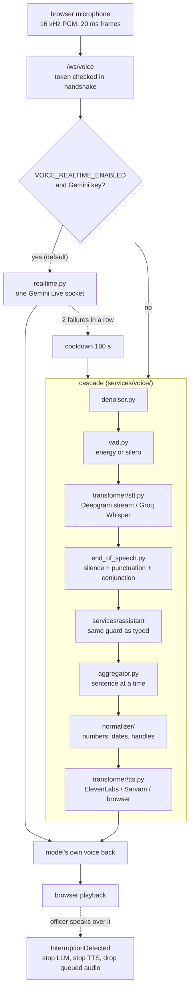

# SENTINEL — the voice assistant

An officer can talk to the console. The microphone opens at sign-in, the
assistant answers aloud, and it can be interrupted mid-sentence.

Two engines exist for that. The default is one bidirectional Gemini Live stream;
behind it sits a full cascade pipeline that does the same job out of separate
parts. Both end at the *same* assistant, with the same guard, the same
rank-filtered tools and the same audit write — **voice is a transport, not a
wider permission.**



## Why the realtime engine is the default

Every stage of a cascade adds a wait, and they land in the one place a human
notices — the gap between finishing a question and hearing anything:

```
  energy VAD waits out a 350 ms pause to decide the sentence ended
+ a batch recogniser cannot start until that decision is made
+ a full round trip to transcribe the whole utterance
+ a tool-calling turn
+ a synthesiser, which cannot start until a sentence is complete
```

Gemini Live collapses the first three and overlaps the last two. More
importantly its turn detection is the model's own: it knows the difference
between a thinking pause and a finished question **because it understands the
words**, which no energy threshold ever will. That single difference is most of
what makes an assistant feel like a conversation rather than a walkie-talkie.

`VOICE_REALTIME_THINKING_BUDGET` is 0 by design — measured as the right answer
for this assistant. A negative value leaves the model's own default alone.

## Why the cascade still exists — and why it is refused by default

The cascade is not merely slower. It ends a turn on a 350 ms pause, so it
**answers half-questions**, and an assistant that confidently replies to the
first half of a sentence is worse than one that is plainly unavailable.

`VOICE_REALTIME_REQUIRED` defaults to **true**: if the Live socket will not
open, the voice connection fails loudly instead of quietly downgrading. The
downgrade used to be invisible, which is how a Gemini fault survived as "the
assistant feels worse" instead of an error anybody could act on.

Set it false for a deployment that must keep a microphone during a Gemini outage
or an exhausted quota — `GEMINI_LIVE_MODEL` is a *preview* alias, and those do
get retired — where a degraded assistant beats a dead panel.

Failure handling in between: two consecutive failures (not one — a single
dropped socket is normal and the browser reconnects transparently) mark the
engine unavailable for `VOICE_REALTIME_COOLDOWN_SECONDS` (180 s), so a reconnect
loop cannot defeat the cooldown and a reopened quota window is picked up without
a restart.

## The packet architecture

The cascade is built on packets, ported from Rapida's design. **Every component
is deaf to every other component**: the VAD does not call the STT, it emits a
packet, and one router (`session.py`) decides what that packet means and who
hears it next.

```
UserAudioReceived                    a 20 ms frame from the browser
  → DenoiseAudio       → denoiser
  → DenoisedAudio      → VAD
  → VadSpeechActivity  → interruption check, then gate
  → SpeechToTextAudio  → recogniser
  → SpeechToText       → end-of-speech detector
  → EndOfSpeech        → the assistant
  → LLMResponseDelta   → aggregator
  → TextToSpeechText   → normalizer → synthesiser
  → TextToSpeechAudio  → the browser
```

That indirection buys the two things a voice agent lives or dies on:

* **Interruption.** When the officer talks over an answer, one packet
  (`InterruptionDetected`) must stop the LLM, stop the TTS, drop the audio
  already queued for playback and roll the turn back — four components, none of
  which knows about the others. With direct calls that is a tangle of
  cancellation plumbing; with packets it is one router branch.
* **Substitution.** Whisper-on-Groq and Whisper-running-locally emit the same
  `SpeechToText` packet, so which one is configured changes nothing downstream.
  The same holds for the TTS providers, the two VADs and the two denoisers —
  `types.py` carries the Protocols the factories are annotated with.

Audio is 16 kHz signed 16-bit little-endian mono **everywhere inside** the
pipeline. Conversion to whatever the browser or a provider wants happens at the
edges (`audio.py` and the transformer adapters), never in between.

## Recognition and synthesis

**STT** — `VOICE_STT_PROVIDER=auto` prefers Deepgram's streaming socket when
`DEEPGRAM_API_KEY` is set, and falls back to Groq Whisper. That preference is
the biggest lever on how the assistant *feels*: every other recogniser here is
batch, and a batch recogniser cannot begin until the officer has stopped
talking, so a five-second question costs its own length again. Deepgram's
`nova-3` with `language=multi` handles code-mixed Gujarati/Hindi/English in one
utterance, which is the normal case in a Gujarat control room and exactly what a
single pinned language breaks.

`VOICE_LANGUAGE=auto` leaves the language unpinned for the same reason: pinning
to `en` makes Whisper transliterate Gujarati into nonsense English instead of
transcribing it.

**TTS** — `auto` walks ElevenLabs → Sarvam → the browser's own speech synthesis.
The browser end of that ladder costs nothing, adds no round trip, and keeps the
answer on the machine, which in a police deployment is an argument in its own
right. (Groq's `playai-tts` was here and is decommissioned upstream.)

## End of speech

`end_of_speech.py` does not use a fixed pause. `VOICE_EOS_SILENCE_SECONDS`
(0.35 s) is the base, **shortened** after terminal punctuation and **lengthened**
after a trailing conjunction — "show me Surat and…" is not a finished question,
and the transcript says so.

## The wake word

`VOICE_WAKE_WORD_ENABLED` defaults to **off**, and the reason is worth stating.
When it is on, every utterance that does not name Sentinel produces *silence* —
which is indistinguishable from a broken microphone to anyone who has not been
told. A feature whose failure mode looks identical to a bug does not belong on
by default. A single operator at a desk gains nothing from it and loses the
ability to just talk.

Turn it on for a shared control room, where otherwise the assistant answers the
whole room's conversation aloud. After an answer there is a
`VOICE_WAKE_FOLLOW_UP_SECONDS` (20 s) window where the name is not needed —
"Sentinel, brief me on Surat" / "and Rajkot?" is one exchange, not two.

## Session limits

| Setting | Default | Why |
|---|---|---|
| `VOICE_IDLE_TIMEOUT` | 900 s | an open microphone is a privacy cost as much as a money one; the browser reconnects transparently |
| `VOICE_MAX_SESSION_SECONDS` | 1800 s | bounded sessions |
| `VOICE_MAX_CONCURRENT_SESSIONS` | 8 | one control room |
| `RATE_LIMIT_ASSISTANT` | 40/60 | deliberately tighter than the read budget — a hot mic in a noisy room must not eat the analyst's own quota |

## Safety

The assistant reached by voice is the same package the typed endpoint uses:

* the same refusal check on every question,
* the same rank-filtered tools, filtered twice (what the model is shown, and
  what is allowed to run),
* the same read-only SQL sandbox, which cannot reach post text, accounts, the
  audit trail or the registry,
* the same audit row for every action.

Adding a microphone does not widen what may be asked. See [LLM.md](LLM.md) and
[SECURITY.md](SECURITY.md).

## Local voice weights

Neural TTS/VAD weights (~336 MB) are gitignored. One command restores them:

```bash
cd backend && python -m app.services.voice.bootstrap
```
