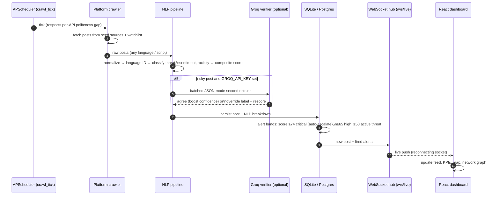
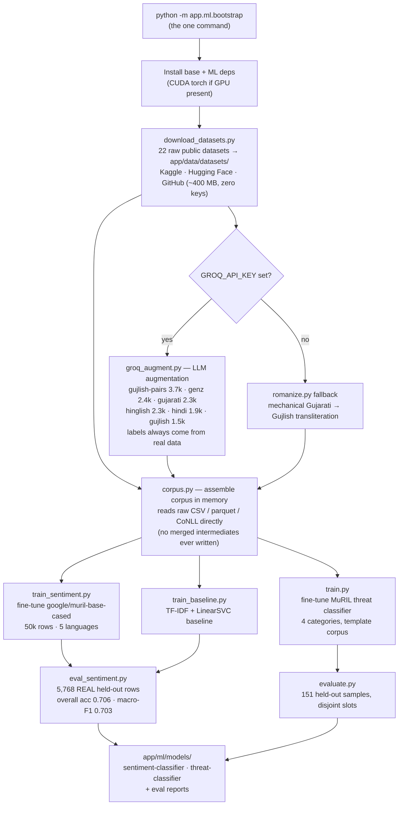
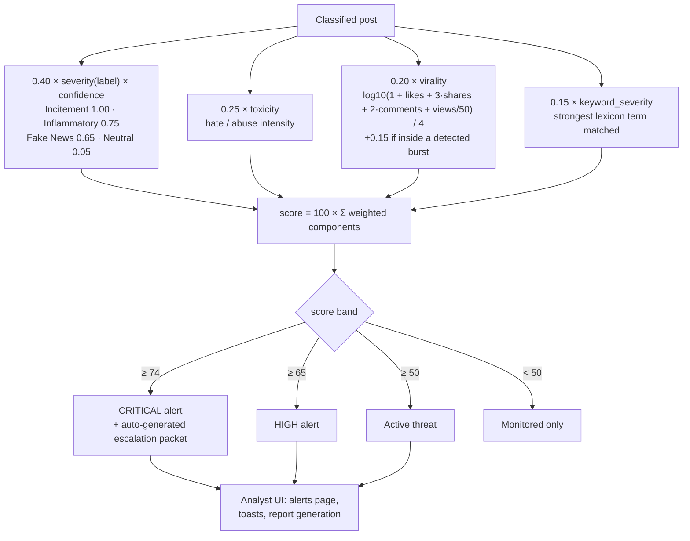

# SENTINEL — Architecture Diagrams

All diagrams are written in [Mermaid](https://mermaid.js.org/) and render natively on GitHub.
Each `.mmd` source file in this folder is validated with the Mermaid renderer; the
"edit live" links open the same diagram in the Mermaid Live editor.

| Diagram | Source | Edit live |
|---|---|---|
| System architecture | [`system-architecture.mmd`](system-architecture.mmd) | [open](https://l.mermaid.ai/zKcOWa) |
| Ingestion sequence (tick → dashboard) | [`ingestion-sequence.mmd`](ingestion-sequence.mmd) | [open](https://l.mermaid.ai/9CxgcF) |
| ML training pipeline (`app.ml.bootstrap`) | [`ml-training-pipeline.mmd`](ml-training-pipeline.mmd) | [open](https://l.mermaid.ai/ZjaNDC) |
| Threat scoring & alert bands | [`threat-scoring.mmd`](threat-scoring.mmd) | [open](https://l.mermaid.ai/Gb8Kqe) |
| Frontend structure | [`frontend-structure.mmd`](frontend-structure.mmd) | [open](https://l.mermaid.ai/4p1cAj) |

---

## 1. System architecture

End-to-end flow: platform collectors → NLP pipeline → intelligence layer → storage → API → dashboard.

```mermaid
flowchart LR
    subgraph COLLECT["Collectors — APScheduler loop, per-API politeness gaps"]
        SIM["Simulated stream (default, zero-key)"]
        FB["Facebook Graph API"]
        IG["Instagram Graph API"]
        RD["Reddit OAuth API"]
        XA["X API v2"]
        YT["YouTube Data API v3"]
        RSS["Generic Web / RSS"]
    end

    subgraph NLP["NLP Pipeline — full (MuRIL) / lite (lexicon) engines"]
        NORM["Normalize: slang, transliteration,\nURL/mention stripping"]
        LID["Language ID\nen / hi / gu / hinglish / gujlish"]
        THREAT["Threat classifier (4-way)\nfine-tuned MuRIL"]
        SENT["Sentiment + intent\nfine-tuned MuRIL"]
        TOX["Toxicity + hate flags"]
        SCORE["Composite threat score 0–100"]
        VERIFY["Groq LLM verification\n(optional second opinion)"]
    end

    subgraph INTEL["Intelligence"]
        TREND["Trend + z-score spike detection"]
        NET["Network centrality (networkx)"]
        BOT["Bot-cluster / coordinated\namplification detection"]
        ALERT["Alerting + escalation packets"]
        REPORT["PDF report generation"]
        GEO["Per-city geo-tagging\nSurat · Ahmedabad · Vadodara · Rajkot"]
    end

    COLLECT --> NORM --> LID --> THREAT --> SENT --> TOX --> SCORE --> VERIFY
    VERIFY --> INTEL

    DB[("SQLite / Postgres\n(SQLModel)")]
    API["FastAPI\nREST + WebSocket /ws/live"]
    FE["React + Vite + TypeScript\nTailwind · GSAP · Recharts · d3-force"]

    INTEL --> DB
    NLP --> DB
    DB --> API --> FE
```

## 2. Ingestion sequence

What happens on every scheduler tick, from crawl to live UI push.

## 3. ML training pipeline

Everything `python -m app.ml.bootstrap` does, including the Groq augmentation branch.

## 4. Threat scoring & alert bands

The composite score formula (`0.40 severity + 0.25 toxicity + 0.20 virality + 0.15 keywords`) and the bands that fire alerts.

## 5. Frontend structure

How `frontend/src` is organized: typed services feed hooks, hooks feed pages, pages compose components.

```mermaid
flowchart LR
    subgraph SERVICES["services/"]
        APITS["api.ts\ntyped REST client for every endpoint"]
        WSTS["ws.ts\nreconnecting /ws/live socket"]
    end

    subgraph HOOKS["hooks/"]
        POLL["usePolling"]
        LIVE["useLive / useLiveAlerts / useLiveStatus"]
        GSAPH["useGsapReveal · useCountUp"]
    end

    subgraph PAGES["pages/ (React Router)"]
        LAND["/ Landing"]
        DASH["/app Dashboard"]
        FEED["/app/feed Threat Feed"]
        NETP["/app/network Network"]
        TRND["/app/trends Trends"]
        ALRT["/app/alerts Alerts"]
        REPT["/app/reports Reports"]
        WTCH["/app/watchlist Watchlist"]
        SETT["/app/settings Settings"]
    end

    subgraph COMPONENTS["components/"]
        LAY["Layout · Sidebar · TopBar"]
        CARDS["GlassCard · StatTile · FeedItemCard\nBadges · Skeletons · Sparkline"]
        VIZ["GujaratMap (SVG geo)\nNetworkGraph (d3-force canvas)"]
        FX["BackgroundFX · AlertToasts · DetailDrawer"]
    end

    APITS --> POLL --> PAGES
    WSTS --> LIVE --> PAGES
    PAGES --> COMPONENTS
    GSAPH --> COMPONENTS
```

